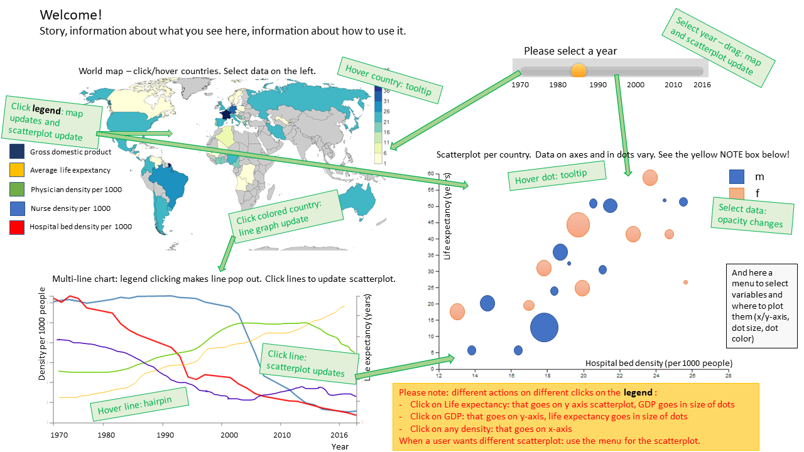

# Data Processing - Programming Project

Do you want to live a long, healthy life? Most people do! However, even if you avoid accidents and murderers, you still have to face disease, infections, and eventually wear and tear due to old age - to eternity. Nonetheless, we still try to prolong our lifes as much as possible. The success of this endeavor varies greatly. 

#### Let us explore some supporting means of health care and their influence on life expectancy around the world!

https://rianneschoon.github.io/DataProject/

### Problem statement
We can wonder whether reaching old age is an achievement of operational interventions by modern medicine, or something else. Maybe just receiving aid, as given by nurses or provided by a hospital, is important. Or, perhaps, having access to enough food and good housing is important, for which money is needed. Since this is not known by many people, this visualization offers a hand!

### Solution
This project aims to let a user explore the effectiveness of health care on the life expextancy of people. The website offers information about the above mentioned types of care and allows the user to select, adjust, and test the questions raised. The visualizations provide an overview of the care that countries around the world provide their people with. For each country, the development of care can be studied over time. Also, several types of care or their effect on life expectancy can be correlated, with the user selecting which correlation they want to investigate. 

## General layout of the project

The health care variables are the amount of doctors, nurses, and available hospital beds per 1000 of population; Life expectancy in years; and Gross Domestic Product (GDP) in USD ($). The map, linechart and scatterplot let you explore the distribution, relation, and development of these variables. Additional options to select time and variables stimulate exploration even further!

### Visualisations:

* **World map**: depicting three types of care (physician density, nurse density, hospital bed density), life expectancy, and GDP. The user can select which variable they want to see coloured in the map (radiobutton) and on which time (slider). Every variable has its own color. Countries can be clicked to see specific info in the line graph. Tooltips popup on hover to show country name and variable value. Not every country has data: only countries that are affiliated with The Organisation for Economic Co-operation and Development (OECD) are selected. This way validity of the data and investigation methods can be guaranteed. 
* **Linechart**: per country that shows the three types of aid (y1-axis) and life expectancy or GDP (y2-axis) in time. Radiobuttons make according variable line pop-out. Click on the map to select a country to show in the line chart! The grey line shows the year selected with the slider. 
* **Scatterplot**: health care variables alternate on the y-axis. When those are selected in the buttons, Life expectancy is on the y-axis and GDP is in the size of the dots. When GDP is selected, it goes on the y-axis and Life expectancy goes in the size of the dots. Hover over dots to see the information. Clicking a country in the map highlights that country in the scatterplot. Or select countries yourself, by clicking on the legend to highlight an entire continent!

### Visualisation interactivity and other interactive elements:
* When clicking a country on the map, the multiline graph is updated according to that country.
* When clicking a country on the map, this country pops up in the scatterplot. All different time points of that map-clicked-country will become visible in the scatterplot, with the 'current' time with the highest opacity.
* Hover over country in map yields pop-up with country name and additional information.
* Hover over line in linechart yields pop-up with info on which axis the variable sould be read.
* Hover over dot in scatterplot yields pop-up with information and countryname.
* Click scatterplot legend to select subset of countries to highlight (by continent)
* Different time points can be selected with a slider - updates map, scatterplot, and time-line in linechart.
* Different variables can be selected with radiobuttons - updates map, scatterplot, linechart (line highglight and in some cases the y2-axis).

### Sketches:

## Prerequisites

### Data sources
* http://www.oecd.org/health/health-statistics.htm

### External components
-* d3js.org/d3.v3.min.js
-* d3js.org/topojson.v1.min.js
-* d3js.org/queue.v1.min.js
-* labratrevenge.com/d3-tip/javascripts/d3.tip.v0.6.3.js
-* jQuery

### Hardest parts
The hardest part is going to be the coloring of the map - I have not done that in previous weeks, so that is new.

Copyright &copy; Rianne Schoon 2018
