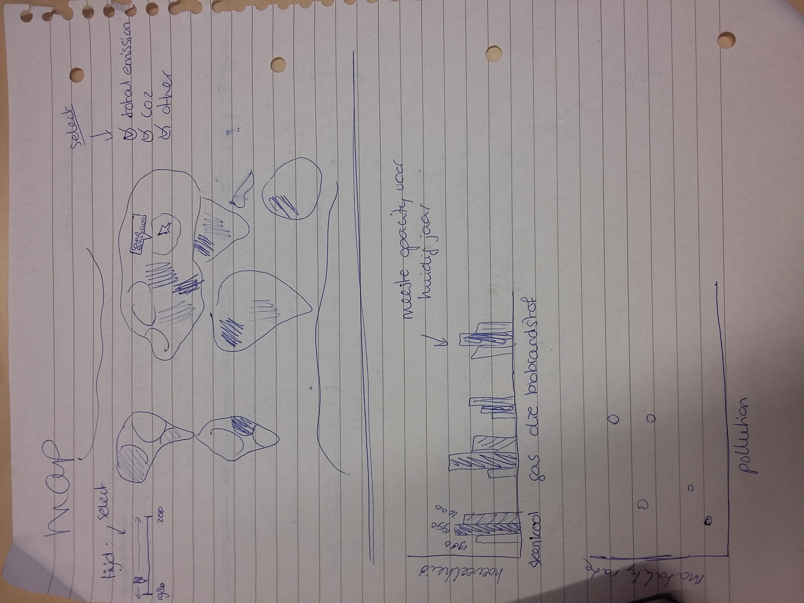

# Data Processing - Programming Project Proposal

We all know the environment is deteriorating. Everyday we face news of rising temperature and water levels, animal populations migrating or going extinct, and the formation of a plastic soup in our increasingly lifeless oceans. Although humans have a fundamental role in the majority of these changes, some people arrogantly deny their responsibility since there does not seem to be much immediate, personal damage or risk for us, rich Western nations. However, humans are just another part of the ecosystem. 

### Problem statement
When interacting with these visualizations, the public will gain a better understanding of the impact that emissions have on peoples health. Furthermore, the generally unaware public is encouraged realize that however the change they notice in their day-to-day lives may be infinitesimal, on the large scale and in more time, the shift we are witnessing is immense.

### Solution
This project aims to address the magnitude of air pollution by greenhouse gases, and to explore a relation between environmental pollution and mortality rates in countries across the world.

## General layout of the project

### Visualisations:
* Map of the world depicting greenhouse gas emissions per country by color. Countries are clickable. The map can show total greenhouse gas emissions / CO2 emissions / other greenhouse gas emissions (checkbox)
* Barchart depicting the sources of these emissions - their nature and quantity - per country.
* Scatterplot depicting the relation between air pollution and the age-standardized mortality rates per 100000 individuals. The dot size represents the Gross Domestic Product of the country.

### Visualisation interactivity and other interactive elements:
* When clicking a country on the map, the barchart is updated according to that country.
* When clicking a country on the map, the scatterplot is updated according to that country. All different time points are visible in the scatterplot, but the 'current' time has the highest opacity.
* Different time points can be selected - apply to all graphs.
* "Global" option. When clicked, the barchart shows the global average sources of greenhouse gas emissions, and the scatterplot shows all countries again for the 'current' time.
* Checkbox of map (total emissions / CO2 / other than CO2)

### Sketches:

## Prerequisites

### Data sources
* https://data.worldbank.org
* http://apps.who.int/gho/data/node.main.122?lang=en

### External components
* d3js.org/d3.v3.min.js"
* d3js.org/topojson.v1.min.js"
* d3js.org/queue.v1.min.js"
* labratrevenge.com/d3-tip/javascripts/d3.tip.v0.6.3.js"

### Hardest parts
The hardest part is going to be the coloring of the map - I have not done that in previous weeks, so that is new.
